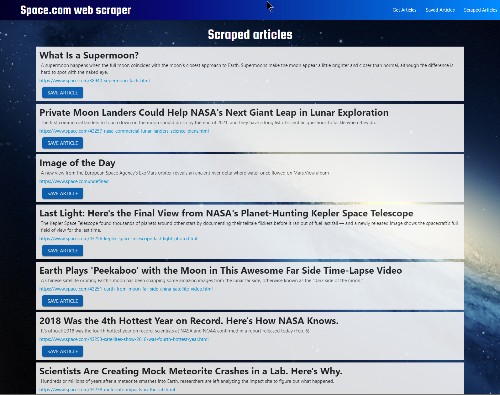

# WebScraper

## [Deployed app](https://evening-fjord-22092.herokuapp.com/)

## About WebScraper

WebScraper is a full-stack web app that allows users to scrape (extract) content from the Space.com website, save articles from that site, and add comments.

## Why this app?

WebScraper was written to address the problem of how to compile relevant content from a website, present it to the user, and allow them to save articles for later reading, as well as add comments.

## Technical Solutions

- Cheerio provided the web scraping functionality. To get the relevant content displayed correctly (no spaces, newline characters, etc.), regular expressions were used to filter the results.
- A MongoDB database stores scraped articles and added notes.
- Mongoose was used to create schemas for the MongoDB articles and notes collections.
- Axios was used as the HTTP client.
- Express Handlebars was used as the templating engine.
- Materialize was used as the front end framework.
- The app was run locally for development and testing, and deployed to Heroku.

## Built With

- [Axios](https://github.com/axios/axios)
- [cheerio](https://cheerio.js.org/)
- [Express](https://expressjs.com/)
- [express handlebars](https://github.com/ericf/express-handlebars)
- [Materialize](https://materializecss.com/)
- [MongoDB](https://www.mongodb.com/)
- [Mongoose](https://mongoosejs.com/)
- [Node.js](https://nodejs.org/en/)

## Authors

WebScraper was coded by me, and is maintained by me.
